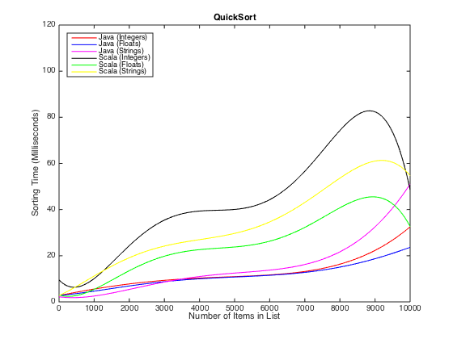
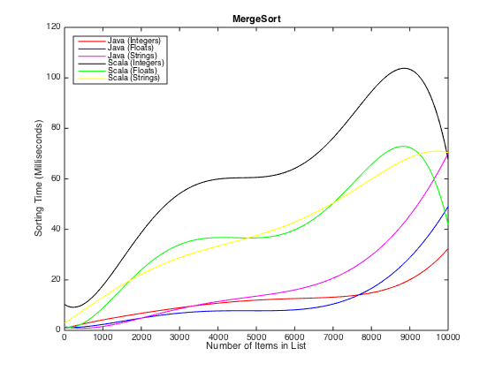
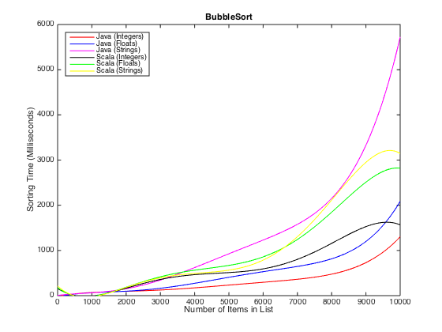

###What is this?

This is an implemention of Quick Sort, Merge Sort, and Bubble Sort in both Scala and Java. It is meant to compare the ease of programming, coding style, and efficiency of each language. It should be noted that I have had more experience with Java than with Scala prior to performing this test, so the number of compiler errors should be taken with a grain of salt.

#####Number of compile/runtime errors during the writing of each algorithm for each language. 
*Note: *If there were multiple errors in any single compile, only one was fixed at a time, and then the code was recompiled. This gives a more accurate estimate rather than fixing multiple errors at once.

| Algorithm | Java | Scala|
|-----------|------|------|
|Bubble Sort|  25  |   40 |
|Quick Sort |   7  |   20 |
|Merge Sort |   5  |  27 |

To compile the java section

```
javac Main.java
```

To compile the scala section

```
scalac Main.scala quicksort/Sort.scala mergesort/Sort.scala bubblesort/Sort.scala

```

The main branch of the repo has a main function that runs a sample of each sort with a small list of ten items to demonstrate functionality.

To view the time comparison, switch to the TimeComparison branch, which is used as follows.

```
java Main <# Items per List>
```
or

```
scala Main <# Items per List>

```
This performs a Quick, Merge, and Bubble sort on lists of Integers, String, and Floats. Each list has randomized entries and a random order.

The output is a single line of times in Milliseconds in the following order:

* Integer QuickSort time
* Float QuickSort time
* String QuickSort time
* Integer MergeSort time
* Float MergeSort time
* String MergeSort time
* Integer BubbleSort time
* Float BubbleSort time
* String BubbleSort time

Using a series of bash and matlab scripts I was able to visualize some of the data as seen below.





#####Data Discussion

First comparing the various sorting methods. 

We can see that MergeSort and BubbleSort are very similar in performance, notice their y-axis. The Bubble sort is terrible in all cases, but especially it seems for Sorting java strings. This is odd because the way I implemented the random strings, java only selects from lower case letters, while the scala implementation selects from Upper, lower, and numeric characters. Having the larger character set I was almost certain scala would be slower. The method I used for both languages is near identical for bubble sort.

Next notice the similarities between MergeSort and QuickSort, not only are their axis at the same range, but the shape of each line pair accross graphs seems to be a mirror image, if only a slight bit scaled. The implementation is also very language specific in each case. The java implemntations stayed fairly close to the pseudo code for each algorithm, where as the scala implemntations use much of scala's syntactic sugar. 

Despite this differences in implementation, the similarity in performance is clear, leading me to believe that scala's synactic sugar is little more than a programming novelty, and lends no benefit to the actual running of the program.

Comparing the 2 language's Merge and Quick Sorts, it can be seen that scala's implementation is slower than java's in all types, if only by a little bit.

Im granting java the winner in this poorly judged contest, however; a chance for redemption is due once my scala programming skills improve, as perhaps my implementation does not do the language justice right now.

#####Implementation Discussion

This entire project was a bit rushed but alot was learnt. Firstly Ive said it before, I am not a master of scala, or a journeyman, or an apprentice, or a padawan. Im terrible at it. Martin Odersky's Scala By Example has helped immensely.

>Scala 

Was difficult, although the implementations are fairly readily available online, it has taken me days to fully understand each one and tailor it to my needs. The syntactic sugar that scala 'offers', coupled with the functional OOP overlap make for a very steep learning curve and frustrating learning experience. That being said I can see how it could be considered a powerful language once it was fully understood.

One of the pitfalls I ran into was reoccuring stack overflow errors in the merge sort with lists above 4000 items. This was happening because I was not implementing tail-recursion. Once I switched to a tail recursive implementation it ran fine with upwards of 100000 items.

Something that I really like about scala is being able to pass an anonymous compare function to any of these sort implementations. It makes for some very unique and easy to implement sorting definitions that would be otherwise many lines of code in java.

Scala's code was much shorter overall, but in my opinion it has gone too far. It has sacrificed a quick programming experience for the Scala Master, at the cost of 0 readability for everyone else. And if code reuse is as important as I think it is, which it is, thats bad.

>Java

The java implementation of each algorithm was fairly straight forward. I basically stuck to a line by line copy of the pseudo code on wikipedia for each algorithm, just in Java form. That said the comparator generics were kind of a mashup. I had the generic type extend Comparable, and the class itself extend Comparator. This led to the easiest implementation of a custom comparator later and only ended up being 2 lines of code in the program as seen below.

```
public int compare(T a, T b) {

	return a.compareTo(b);

}
```

This allows a simple boolean to passed globally to change an order to ascending or descending. This is great although is one of java's many pitfalls in that I had to hack together 2 comparators to make it work.

The main function is a bit of a mess, which is my own fault, it was an afterthought because I originally implemented each Sort as its own executable class and then abstracted the execution after. I will 'read first code later' next time.